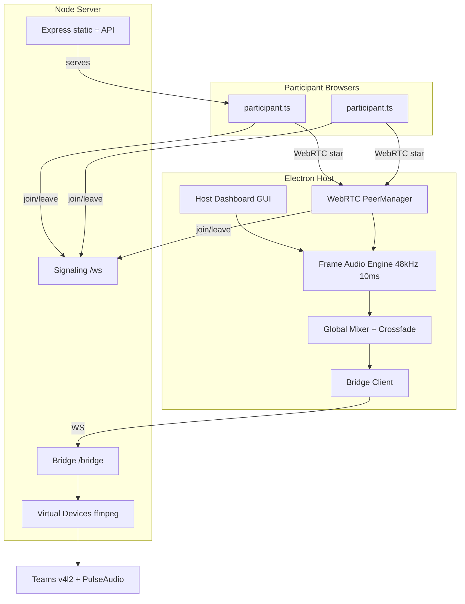

# Spidercam Next Iteration: Architecture + UI Specification

## Current baseline

Spidercam today is a **Node monorepo** (no Electron): Express server + vanilla Vite web UIs. The host opens [`apps/web/host.html`](apps/web/host.html) in a browser, participants join at `/`. Seats are wired through types, selector, and both UIs. Audio routing is **level-threshold + seat-distance** in [`packages/shared/src/selector.ts`](packages/shared/src/selector.ts); mixing is **hard gain switching** in [`apps/web/src/host/mixer.ts`](apps/web/src/host/mixer.ts). Styling lives in [`apps/web/src/styles/global.css`](apps/web/src/styles/global.css) (`--accent: #3dd68c`, dark panels, mono labels, green meters).

---

## Target architecture



| Concern          | Today                       | Target                                                                              |
| ---------------- | --------------------------- | ----------------------------------------------------------------------------------- |
| Host shell       | Browser at `/host.html`     | **Electron** window loads host UI; server starts with app                           |
| Availability     | "Start host" screen         | **Always online** when app runs — no start/end session                              |
| Participants     | Pick seat 0–7               | **Name + connect** only; dynamic join/disconnect                                    |
| Routing          | Level + seat distance       | **Per-stream score** (level, SNR, VAD, host priority) + hysteresis + crossfade      |
| Host page        | 2-col + sidebar video cards | **One full-screen console** — output + mixer brain + stream rail + transport footer |
| Participant page | Connect + session table     | **One full-screen confidence monitor**                                              |

**New workspace:** `apps/electron` — thin shell (`main.ts`, `preload.ts`) that spawns [`apps/server`](apps/server), opens host UI (file:// or bundled Vite dist), exposes optional tray menu (quit, open participant URL, copy LAN link). Host dashboard is **removed from public web** (or redirected); only participants are served at `/`.

---

## Domain model changes

Remove seat concepts from [`packages/shared/src/types.ts`](packages/shared/src/types.ts), [`messages.ts`](packages/shared/src/messages.ts), [`selector.ts`](packages/shared/src/selector.ts), [`room.ts`](apps/server/src/room.ts), tests, and README.

**`ParticipantInfo`** — drop `seat`; add optional `deviceLabel` (mic/cam name from browser).

**`HostConfig`** — drop `seatCount`, `hostSeat`; keep tuning knobs (`audioThreshold`, hold times, score weights, crossfade duration).

**`StreamMetrics`** — extend for live UI + pipeline:

```ts
interface StreamMetrics {
  participantId: string;
  name: string;
  role: "host" | "participant";
  // levels
  rmsDbfs: number;
  peakDbfs: number;
  speechLevelDbfs: number; // long-term, VAD-gated
  noiseFloorDbfs: number;
  snrDb: number;
  // routing
  vad: boolean;
  vadHangoverMs: number;
  score: number; // S_i smoothed
  scoreComponents: {
    level: number;
    snr: number;
    vad: number;
    priority: number;
    echoPenalty: number;
  };
  rank: number;
  gateGainDb: number;
  duckingGainDb: number;
  calibrationGain: number; // g_cal_smooth
  calibrationPhase: "idle" | "measuring" | "applying" | "done";
  jitterBufferFrames: number;
  delayOffsetMs: number;
  isMainTalker: boolean;
  // transport (existing)
  rttMs;
  packetLoss;
  jitterMs;
  bitrateKbps;
  framesPerSecond;
  lastUpdated;
}
```

**`SelectionState`** — add `mixerState: "LOCKED" | "HOLD" | "SWITCH" | "SILENCE"`, `holdRemainingMs`, `crossfade: { from: string; to: string; t: number } | null`, `switchEvents: { at: number; from: string; to: string }[]`.

**`RoomState`** — drop `seatCount`; add `hostOnline: true`, `globalLatencyMs`, `cpuPercent`, `outLevelDbfs`.

Signaling: `join` message drops `seat`; remove `config` message for seat count. Host auto-joins on Electron launch.

---

## Audio pipeline (phased)

Align with researcher MVP; implement in **host-side AudioWorklet / WASM** (Electron can load native addons later; start in Web Audio for parity with current [`mixer.ts`](apps/web/src/host/mixer.ts)).

### Phase A — Selector + crossfade (unblocks UI)

- Replace seat-distance logic in [`selector.ts`](packages/shared/src/selector.ts) with score-based hysteresis (research doc §3.1–3.3).
- Replace hard `gain 0/1` in [`mixer.ts`](apps/web/src/host/mixer.ts) with **equal-power crossfade** (50–150 ms) on audio switch.
- Host priority: `priority = 1.0` for host stream, `0.0` for participants; optional force-host when host VAD active.
- Publish full `SelectionState` + per-stream scores at 20 Hz over existing `selection` broadcast.

### Phase B — Per-stream analysis (frame loop)

10 ms frames @ 48 kHz (480 samples) per stream:

1. Jitter buffer + timestamp alignment (coarse; skip GCC-PHAT initially)
2. Level calibration (slow EMA toward −20 dBFS during speech)
3. Noise floor (update on non-speech frames)
4. Simple VAD (SNR + band energy + hangover)
5. Score computation + gate/ducking

Enhancement: start with **Web Audio HPF + conservative processing**; plan WebRTC AudioProcessing or RNNoise as optional native module in Electron.

### Phase C — Host AEC + output limiter

- AEC only on host playback reference path (research §2.2).
- Master soft limiter on mixed output before bridge.

### Deferred

Beamforming, MLS calibration sweeps, GCC-PHAT fine delay, DNN VAD — debug/experimental only.

---

## UI specification

Design principle: **every pixel shows mixer state**, not decoration. Preserve [`global.css`](apps/web/src/styles/global.css) tokens; add widget classes (`.vad-pill`, `.score-stack`, `.meter-peak`, `.hold-badge`).

### Use cases

| ID    | Actor       | Goal                                         | Success                                                             |
| ----- | ----------- | -------------------------------------------- | ------------------------------------------------------------------- |
| UC-H1 | Host        | Start Spidercam and be immediately reachable | Electron opens; bridge connects; LAN URL copyable; no config screen |
| UC-H2 | Host        | See what Teams receives                      | Output preview shows virtual cam feed + OUT level                   |
| UC-H3 | Host        | Understand who is routed and why             | Main talker, score, hysteresis state, crossfade visible             |
| UC-H4 | Host        | Monitor each mic channel health              | Per-stream rail: level, VAD, SNR, score, transport                  |
| UC-H5 | Host        | Diagnose problems                            | Debug drawer: score breakdown, switch log, selector reason          |
| UC-H6 | Host        | Tune routing aggressiveness                  | Adjust hold time, crossfade, host-priority (settings, not session)  |
| UC-P1 | Participant | Join quickly                                 | Name + server URL + device toggles; no seat                         |
| UC-P2 | Participant | Confirm mic works                            | Live level meter + dBFS/SNR                                         |
| UC-P3 | Participant | Know if on-air                               | "On air: Alice" vs "Not routed"                                     |
| UC-P4 | Participant | Leave cleanly                                | Disconnect stops tracks and WS                                      |

### Host page — layout (1080p, no page scroll)

```
┌─────────────────────────────────────────────────────────────────────────┐
│ HEADER: spidercam/host · bridge ● · N streams · OUT −12.3 dBFS · 142ms │
├──────────────────────────────────────────┬──────────────────────────────┤
│ OUTPUT PREVIEW (Teams virtual cam)       │ MIXER BRAIN                  │
│ + crossfade overlay when switching       │ Main talker · HOLD/SWITCH    │
│ + 5s OUT sparkline                       │ Hysteresis bar · timeline    │
├──────────────────────────────────────────┴──────────────────────────────┤
│ STREAM RAIL (horizontal scroll): host + participants, ~72px strips    │
├─────────────────────────────────────────────────────────────────────────┤
│ TRANSPORT TABLE: id · level · rtt · loss · jitter · buf · delay · fps  │
│ [debug ▾] — expands drawer over footer only                             │
└─────────────────────────────────────────────────────────────────────────┘
```

**Update loops:** rAF for meters/VAD/crossfade; 100 ms for numerics; 500 ms for CPU/latency.

**Stream strip (per channel):** identity, `MAIN`/`V`/`A` badges, VU meter + peak hold, VAD pill, SNR zone bar, score bar + stacked component micro-bars, optional calibration `×1.12`.

**Mixer brain widgets:** Hold gate (`LOCKED` / `HOLD 420ms` / `SWITCHING` / `SILENCE`), dual-gain crossfade rail, 45 s switch timeline.

### Participant page — layout (one viewport, mobile-first)

```
┌─────────────────────────┐
│ spidercam · connected   │
│ Alice · 4 in room       │
├─────────────────────────┤
│ SELF PREVIEW (16:9)     │
│ corner: VAD pill        │
├─────────────────────────┤
│ YOUR MIC: meter + dBFS  │
│ SNR · signal 89ms       │
├─────────────────────────┤
│ ROOM: On air: Alice     │
│ You: not routed         │
│ [calibrating…] optional │
├─────────────────────────┤
│ [ disconnect ]          │
└─────────────────────────┘
```

Desktop: centered `max-width: 420px`. No routing math on participant view.

---

## User actions catalog

### Host page (Electron)

| Action                   | Trigger                  | Effect                                                                                    |
| ------------------------ | ------------------------ | ----------------------------------------------------------------------------------------- |
| **Launch app**           | OS start / tray          | Server starts, host mic/cam captured, auto-join as `host-mixer`, dashboard shown          |
| **Copy participant URL** | Header button / tray     | Clipboard `http://<lan-ip>:9847/`                                                         |
| **Open settings**        | Gear icon                | Panel overlay: crossfade ms, hold ms, host-priority boost, NS level, score weight presets |
| **Apply settings**       | Settings save            | Updates `HostConfig`; no restart                                                          |
| **Inspect stream**       | Click stream strip       | Expands strip (P2): sparklines, score breakdown, delay/buffer                             |
| **Collapse stream**      | Click again / Esc        | Returns to compact strip                                                                  |
| **Toggle debug drawer**  | Footer `debug`           | Score components table, switch log, raw JSON copy                                         |
| **Quit**                 | Window close / tray quit | Stops bridge, releases devices, stops server                                              |

**Removed actions:** "Start host", seat count, host seat, end session.

**No user actions for:** manual talker pin (v1 — algorithm only; pin can be Phase 2 enhancement).

### Participant page (web)

| Action                     | Trigger        | Effect                                         |
| -------------------------- | -------------- | ---------------------------------------------- |
| **Enter display name**     | Text input     | Sent on join                                   |
| **Edit server URL**        | Text input     | WS/WebRTC target (default: current host)       |
| **Toggle webcam**          | Checkbox       | `getUserMedia` video on/off before connect     |
| **Toggle microphone**      | Checkbox       | `getUserMedia` audio on/off before connect     |
| **Connect**                | Primary button | `join` without seat; WebRTC to host            |
| **Disconnect**             | Danger button  | `leave`, stop tracks, return to connect screen |
| **Grant/deny permissions** | Browser prompt | Standard media permission flow                 |

**Removed actions:** Seat picker.

---

## Implementation map

| Area             | Key files                                                                                                 |
| ---------------- | --------------------------------------------------------------------------------------------------------- |
| Electron shell   | **new** `apps/electron/`                                                                                  |
| Remove seats     | `types.ts`, `messages.ts`, `selector.ts`, `room.ts`, `participant.ts`, `dashboard.ts`, tests, `README.md` |
| Always-on host   | `dashboard.ts` — delete `renderStart()`, auto `startHost()` on load                                       |
| Host UI redesign | `dashboard.ts`, `global.css` — new grid zones, incremental DOM updates (stop full `innerHTML` re-render)  |
| Participant UI   | `participant.ts` — remove seat, add on-air/VAD/SNR                                                        |
| Metrics pipeline | **new** `apps/web/src/host/audio-engine.ts`, `stream-processor.ts`; extend `stats.ts`                     |
| Mixer crossfade  | `mixer.ts`                                                                                                |
| Selector rewrite | `selector.ts` + tests                                                                                     |
| Bridge           | unchanged path; consumes improved PCM from engine                                                         |
| Root scripts     | `package.json` — `npm start` launches Electron; server still `apps/server`                                |

---

## Testing

- Update [`packages/shared/src/selector.test.ts`](packages/shared/src/selector.test.ts) for score/hysteresis (no seats).
- Update e2e: [`e2e/host.spec.ts`](e2e/host.spec.ts), [`e2e/participant.spec.ts`](e2e/participant.spec.ts), [`e2e/room-flow.spec.ts`](e2e/room-flow.spec.ts) — no start screen, no seat field.
- Add unit tests for crossfade gain curves and score normalization.

---

## Suggested delivery order

1. **Electron + always-on host** — shell, auto-start, remove start screen
2. **Remove seats** — types, protocol, UI, selector simplification
3. **Host UI v2** — layout zones, live metrics from existing levels (stub extended fields)
4. **Participant UI v2** — on-air indicator, simplified connect
5. **Score-based selector + crossfade** — real mixer brain data
6. **Frame audio engine** — calibration, VAD, SNR, full stream strips
7. **WebRTC APM / limiter** — polish

```mermaid
gantt
  title Delivery phases
  dateFormat X
  axisFormat %s

  section Foundation
  Electron shell           :a1, 0, 3
  Remove seats             :a2, 0, 2
  Always on host           :a3, 2, 4

  section UI
  Host layout v2           :b1, 4, 7
  Participant UI v2        :b2, 4, 6

  section Audio
  Score selector crossfade :c1, 7, 10
  Frame engine metrics     :c2, 10, 14
  APM limiter              :c3, 14, 16
```


