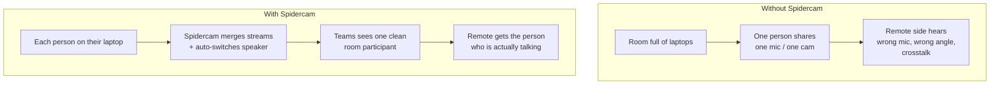
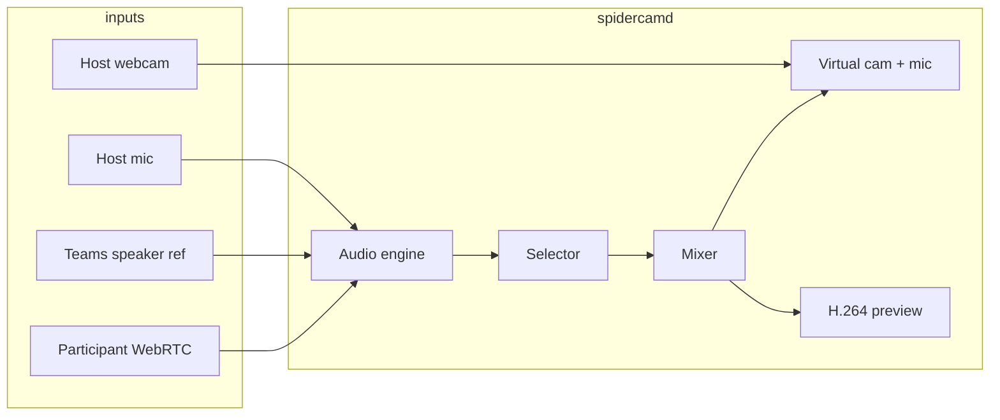

# Spidercam

Spidercam bridges laptops in a physical meeting room into a single Microsoft Teams call on Linux. A **host daemon** on the meeting-room PC captures local mic and webcam, mixes in audio and video from **participants** over WebRTC, and feeds the result to Teams as a virtual camera and microphone.




---

## For users

This guide assumes a fresh checkout of the repository on a **Linux** meeting-room PC (Ubuntu/Debian examples below).

### Prerequisites

Install system packages, Go, and Node.js:

```bash
sudo apt-get update
sudo apt-get install -y \
  build-essential \
  libpipewire-0.3-dev \
  libx264-dev \
  v4l-utils \
  v4l2loopback-dkms
```

You also need **Go 1.25+** and **Node.js 22+** with npm. PulseAudio or PipeWire with Pulse compatibility (`pactl`) must be running for the virtual microphone.

### 1. Build

From the repository root:

```bash
npm install
make build
```

This compiles the host and participant web UIs, embeds them into `bin/spidercamd`, and writes the binary to `bin/spidercamd`. When `libpipewire-0.3-dev` is installed, `make build` also enables native PipeWire capture (`-tags spidercam_native_capture`). Run `make build` again after UI changes.

### 2. Set up the virtual camera (once per machine)

Teams needs a virtual webcam. Load the kernel module:

```bash
./bin/spidercamd setup
```

If that fails, run manually:

```bash
sudo modprobe v4l2loopback video_nr=2 card_label="spidercam-loopback" exclusive_caps=1
```

In Teams, pick **spidercam-loopback** as the camera. The virtual microphone (**Spidercam Virtual Mic**) is created automatically when the daemon starts and removed when it exits.

### 3. Run a meeting

Start the daemon:

```bash
./bin/spidercamd
```

Your browser opens the **host console** at `http://127.0.0.1:1235/`.

1. Copy the **participant URL** from the host header (e.g. `http://192.168.1.42:1234/`) and share it with people in the room.
2. In Teams, select **spidercam-loopback** and **Spidercam Virtual Mic** as your devices.
3. Use the host console to:
   - Preview what Teams receives (H.264 preview panel)
   - Monitor per-participant audio levels and routing
   - Pick capture devices (mic, webcam, speaker output)
   - Tune mixer settings (hold time, crossfade, ducking, echo cancellation, noise suppression)

Stop the daemon with `Ctrl+C`. Peer connections close and the virtual microphone is removed if this run created it. The virtual camera kernel module stays loaded until reboot or manual unload.

#### CLI reference

| Command / flag | Default | Purpose |
| -------------- | ------- | ------- |
| `./bin/spidercamd setup` | — | Load v4l2loopback for the virtual camera (sudo once per machine) |
| `--no-open-browser` | off | Do not open the host UI automatically |
| `--host-addr` | `127.0.0.1:1235` | Host console bind address |
| `--participant-addr` | `0.0.0.0:1234` | Participant UI bind address (LAN-facing) |
| `--mock` | off | Mock capture and output — no real hardware (for testing) |

Optional environment variables:

| Variable | Default | Purpose |
| -------- | ------- | ------- |
| `SPIDERCAM_VIDEO_DEVICE` | auto-detect loopback | Override virtual camera device path |
| `SPIDERCAM_AUDIO_SINK` | `spidercam_sink` | Override PulseAudio sink name |

### Participants

1. Open the participant URL on your laptop (provided by the host).
2. Enter a display name, pick your mic and camera, and toggle them on.
3. Click **Connect** to join the room via WebRTC.
4. The header shows who is on air. Your local preview and level meter run whether or not you are connected.
5. Click **Disconnect** to leave. You stay on the same screen; local preview continues.

If the host daemon goes offline while you are connected, a banner appears and the client retries automatically.

---

## For developers

### Prerequisites

- **Go** 1.25+
- **Node.js** 22+ and npm
- **Linux** for native capture/output (Ubuntu packages below)
- **Chromium** for Playwright UI tests

Native build dependencies (Ubuntu/Debian):

```bash
sudo apt-get install -y libpipewire-0.3-dev libx264-dev v4l-utils
```

Load kernel module for loopback tests:

```bash
sudo modprobe v4l2loopback
```

### Quick start (UI development)

The fastest way to work on frontends without hardware:

```bash
npm install
npm run dev
```

This starts three processes:

| Process | URL | Backend |
| ------- | --- | ------- |
| Host UI | http://127.0.0.1:5175/ | mock server `:1235` |
| Participant UI | http://127.0.0.1:5174/ | mock server `:1234` |
| Mock server | `:1234` + `:1235` | — |

Vite proxies `/api` to the matching mock listener. Open both UIs in separate browser windows, connect a participant, and watch the host console update.

### Build and run the daemon

```bash
make build          # builds web UIs, syncs embed assets, bin/spidercamd
./bin/spidercamd --mock   # run without real capture/output
```

For native PipeWire capture, `make build` enables the tag automatically when `libpipewire-0.3` is available. Manual build:

```bash
CGO_CFLAGS_ALLOW=-.* go build -tags spidercam_native_capture -o bin/spidercamd ./cmd/spidercamd
```

### Testing

```bash
make test           # all Go unit tests
make e2e            # Go API E2E tests (mock daemon)
make check          # vet + raced unit tests + E2E

npm run check       # lint, format check, TypeScript build
npm run test:ui     # Playwright headless UI tests
npm run test:unit   # workspace unit tests
```

Playwright installs Chromium on first run: `npx playwright install chrome`.

Interactive Playwright UI:

```bash
npx playwright test --ui -c e2e/playwright.config.ts
```

### Repository layout

| Path | Role |
| ---- | ---- |
| `cmd/spidercamd/` | CLI entry point |
| `internal/daemon/` | Lifecycle, dual HTTP listeners, embedded UIs |
| `internal/capture/` | PipeWire mic/speaker monitor + v4l2 webcam |
| `internal/webrtc/` | Pion WebRTC hub (browser offers, hub answers) |
| `internal/signaling/` | Host and participant WebSocket handlers |
| `internal/audio/` | 48 kHz engine, echo cancellation, noise suppression, mixer |
| `internal/output/` | v4l2loopback camera + PulseAudio virtual mic |
| `internal/preview/` | H.264 preview stream for host console |
| `web/host/` | SolidJS host console |
| `web/participant/` | SolidJS participant monitor |
| `web/protocol/` | Shared TypeScript protocol types |
| `apps/mock-server/` | Node mock API for UI development and tests |
| `experiments/wave5/` | Validated native I/O spikes (PipeWire, v4l2, x264) |
| `docs/` | Architecture, API, use cases, decisions, glossary |
| `test/e2e/` | Go integration tests against mock daemon |
| `e2e/` | Playwright browser tests |

### Architecture

`spidercamd` runs two HTTP servers:

| Port | Bind | Serves |
| ---- | ---- | ------ |
| **1234** | `0.0.0.0` | Participant SPA + WebSocket signaling/WebRTC |
| **1235** | `127.0.0.1` | Host SPA + host-state WebSocket + H.264 preview + REST API |

Audio flows through a score-based selector that picks the best talker, applies optional echo cancellation and RNNoise enhancement per stream, mixes with a limiter, and writes to virtual devices. Teams speaker output is captured as a playback reference to suppress room loopback.



Full specs: [docs/ARCHITECTURE.md](docs/ARCHITECTURE.md), [docs/API.md](docs/API.md), [docs/USE_CASE.md](docs/USE_CASE.md).

### Code quality

```bash
npm run format      # auto-format with Prettier
npm run lint        # ESLint
go vet ./...        # Go static analysis
```

CI runs on every push and PR: Go vet, unit tests (with native capture tag), E2E tests, JS lint/check, and Playwright UI tests.

### Further reading

| Document | Contents |
| -------- | -------- |
| [web/README.md](web/README.md) | UI dev stack, two-browser testing, Playwright |
| [docs/DECISIONS.md](docs/DECISIONS.md) | Resolved architecture decisions |
| [docs/GLOSSAR.md](docs/GLOSSAR.md) | Term definitions |
| [experiments/README.md](experiments/README.md) | Wave 5 native I/O proof results |
