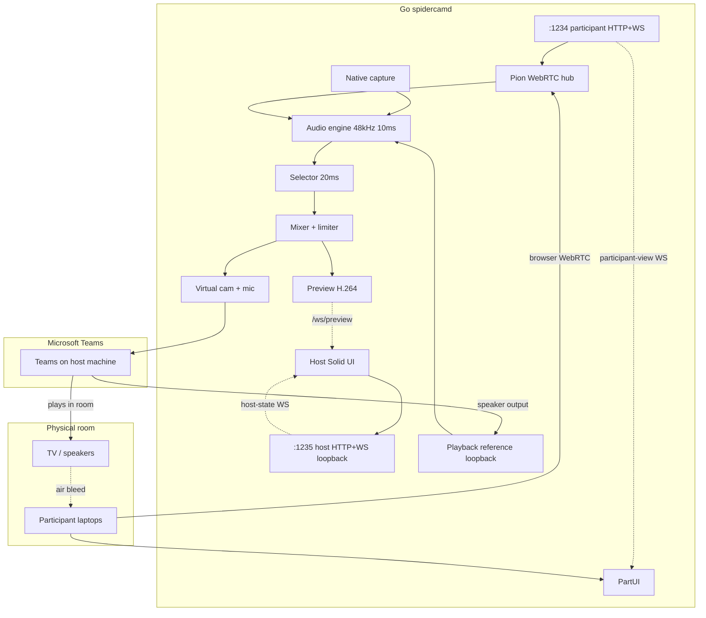

# Architecture

## System context

Single **Go CLI** (`spidercamd`) — run in a terminal, open host UI in the system browser. Owns signaling, WebRTC (Pion), PipeWire capture (C shim), audio engine, mixer, and virtual device output. Two embedded **SolidJS** static sites on separate HTTP listeners.



## Repository layout

| Path | Responsibility |
| ---- | -------------- |
| `cmd/spidercamd/` | CLI entry, flags, embed static UI |
| `internal/cli/` | Flag parsing, exit codes, browser launch |
| `internal/daemon/` | Lifecycle, dual listeners, config |
| `internal/capture/` | Host mic, webcam, speaker monitor (PipeWire C shim + v4l2) |
| `internal/capture/native/` | PipeWire capture cgo |
| `internal/webrtc/` | Pion peer connections (browser offers, hub answers) |
| `internal/signaling/` | Participant WS `:1234`, host WS `:1235`, preview hub |
| `internal/room/` | Room state, roles, config merge |
| `internal/scenario/` | Demo state ticker; hold timers when audio-driven |
| `internal/audio/` | Engine, processor pipeline, reference, mixer |
| `internal/selector/` | Hysteresis + crossfade |
| `internal/output/` | v4l2loopback + PulseAudio virtual mic |
| `internal/preview/` | H.264 preview encoder + stream framing |
| `internal/protocol/` | Canonical JSON types and messages (Go) |
| `web/host/` | SolidJS host console SPA |
| `web/participant/` | SolidJS participant monitor SPA |
| `web/protocol/` | TypeScript mirror of protocol types |
| `web/ui-theme/` | Shared Tailwind theme and widgets |
| `apps/mock-server/` | Node mock API for UI dev and Playwright |
| `experiments/wave5/` | Validated native I/O spikes (P5.1–P5.9) |
| `test/e2e/` | Go integration tests against `spidercamd --mock` |
| `e2e/` | Playwright browser tests (MSW mocks) |

Protocol shapes live in `internal/protocol/` and `web/protocol/`. REST + WS routes: [API.md](./API.md).

## Listeners

| Port | Bind | Serves | WebSocket |
| ---- | ---- | ------ | --------- |
| **1234** | `0.0.0.0` | Participant Solid SPA (`/`) | `/api/v1/ws` — signaling + WebRTC; **`participant-view` only** |
| **1235** | `127.0.0.1` | Host Solid SPA (`/`) | `/api/v1/ws` — **`host-state`** + config; `/api/v1/ws/preview` — H.264; REST under `/api/v1/` |

CLI flags: `--host-addr`, `--participant-addr`, `--no-open-browser`, `--mock`.

Defaults: `127.0.0.1:1235` (host), `0.0.0.0:1234` (participant). The participant URL printed at startup uses the first non-loopback IPv4 when bound to `0.0.0.0`.

## CLI operator flow

```text
terminal$ spidercamd
  → bind :1234 (LAN) + :1235 (loopback)
  → open http://127.0.0.1:1235/ in default browser
  → print participant URL for room laptops
  → run until Ctrl+C
```

Host UI is **not** a desktop app — it is a normal browser tab. Media never runs in the browser on the host.

## Runtime modes

### `--mock` (dev / CI)

Full audio pipeline runs via `internal/audio`:

- Mock sine-wave capture feeds host + participant streams and playback reference
- Selector, mixer, AEC/RNNoise toggles, loop-delay estimation, and enhancement budget are live
- Mock virtual output writer; mock or fixture-based H.264 preview encoder
- Scenario engine runs in **audio-driven** mode (hold timers only; metrics come from the audio engine)

Go E2E tests (`test/e2e/`) and CI use this mode.

### Production (default, no `--mock`)

- **Signaling and UIs** are fully live on both ports
- **WebRTC**: participant browser offers after `join`; Pion hub answers and relays ICE
- **Virtual output**: `internal/output` opens v4l2loopback + PulseAudio sink when devices exist; falls back to unhealthy mock writer on timeout or missing devices
- **Room state**: `internal/scenario` animates metrics, reference levels, loop delay, and transport stats for UI demonstration until capture/WebRTC are wired into the audio engine
- **Preview**: H.264 stream on `/api/v1/ws/preview` from mock compositor + real or mock encoder depending on build tags
- **Capture device API**: returns fixture device lists (native `capture.ListDevices()` is implemented and tested separately)

Native packages (`internal/capture`, `internal/output`, `internal/preview/enc_x264.go`) are production-ready; daemon integration of live capture → engine → output is the remaining wiring step.

## Data flow (target, `--mock` complete)

1. **Participant path:** browser → WS `:1234` (join, slim updates) + WebRTC → Pion → jitter → PCM frames
2. **Host capture:** PipeWire (C) mic + sink monitor + v4l2 cam → engine; devices chosen in host settings
3. **Playback reference:** monitor of **selected output sink** (Teams playback) → reference stream
4. **Processing:** 10 ms pull → dual branch (raw analysis + AEC/RNNoise enhancement) → `echoPenalty` on raw → selector @ 20 ms → crossfade mixer → limiter
5. **Output:** PCM + composited video directly to virtual mic/cam (no browser bridge)
6. **Host UI:** WS `:1235` only — control + H.264 preview; never receives participant LAN traffic; never needs WebRTC

## Timing

| Loop | Rate | Owner |
| ---- | ---- | ----- |
| Frame processing | 100 Hz (10 ms) | `internal/audio/engine` |
| Selector + host-state push | 50 Hz (20 ms) | audio bridge → host WS (mock); scenario engine (default) |
| Participant view push | on change + max 10 Hz | participant WS |
| UI preview (host) | 15 fps H.264 on `/api/v1/ws/preview` | `internal/preview` |
| Transport stats in `host-state` | 1 Hz | Pion stats (when wired) |
| Loop delay fields | ~0.3 Hz | reference delay tracker |

## Room audio loopback problem

Teams plays remote participants on the **host laptop speakers** → TV/room hears it → participant mics pick it up → selector treats bleed as speech.

**Mitigation:** capture speaker output as **playback reference**; raw-tap `echoPenalty` + reference ducking; optional per-stream **WebRTC APM AEC3** and **RNNoise** on the enhancement branch.

Teams AEC on the virtual mic does **not** fix pickup that happens on separate laptops before the mix.

## Build tags and stubs

Linux production builds use cgo (`CGO_ENABLED=1`) for PipeWire capture, libx264 preview, and native AEC/RNNoise shims.

`//go:build !cgo || !linux` stubs in `internal/capture`, `internal/output`, and `internal/preview` allow `go test ./internal/...` without native dev headers. CI installs `libpipewire-0.3-dev` and runs tests with `-tags spidercam_native_capture`.

## Resolved architecture choices

See [DECISIONS.md](./DECISIONS.md).
