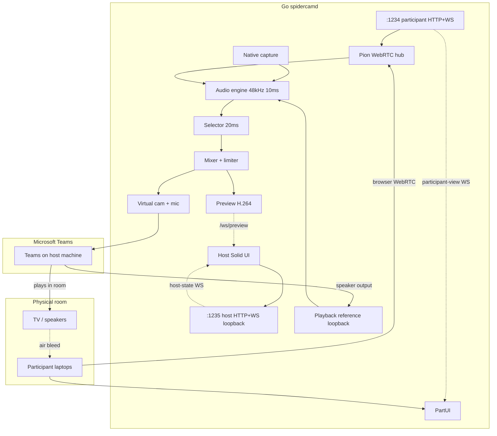

# Architecture

## System context

Single **Go CLI** (`spidercamd`) — run in a terminal, open host UI in the system browser. Owns signaling, WebRTC (Pion), PipeWire capture (C shim), audio engine, mixer, and virtual device output. Two embedded **SolidJS** static sites on separate HTTP listeners.



## Repository layout

| Path                       | Responsibility                                 |
| -------------------------- | ---------------------------------------------- | -------------------------------------------------------- |
| `cmd/spidercamd/`          | CLI entry, flags, embed static UI              | [architecture/daemon.md](./architecture/daemon.md)       |
| `internal/cli/`            | Flag parsing, exit codes, browser launch       |
| `internal/daemon/`         | Lifecycle, dual listeners, config              | [architecture/daemon.md](./architecture/daemon.md)       |
| `internal/capture/`        | Host mic, webcam, speaker monitor              | [architecture/capture.md](./architecture/capture.md)     |
| `internal/capture/native/` | PipeWire C shim (cgo)                          |
| `internal/webrtc/`         | Pion peer connections, RTP → PCM               | [architecture/webrtc.md](./architecture/webrtc.md)       |
| `internal/signaling/`      | Participant WS `:1234`, host WS `:1235`        | [architecture/signaling.md](./architecture/signaling.md) |
| `internal/room/`           | Room state, roles                              | [domain/types.md](./domain/types.md)                     |
| `internal/audio/`          | Engine, processor, reference correction, mixer | [audio/overview.md](./audio/overview.md)                 |
| `internal/selector/`       | Hysteresis + crossfade                         | [audio/selector.md](./audio/selector.md)                 |
| `internal/output/`         | v4l2loopback + PulseAudio virtual mic          | [architecture/output.md](./architecture/output.md)       |
| `internal/preview/`        | H.264 preview encoder + stream                 | [architecture/preview.md](./architecture/preview.md)     |
| `web/participant/`         | Solid participant SPA                          | [ui/participant-monitor.md](./ui/participant-monitor.md) |
| `web/host/`                | Solid host console SPA                         | [ui/host-console.md](./ui/host-console.md)               |
| `web/ui-theme/`            | Shared Tailwind `@theme`                       | [ui/design-system.md](./ui/design-system.md)             |

Protocol JSON shapes: [domain/types.md](./domain/types.md), [domain/messages.md](./domain/messages.md). REST + WS routes: [API.md](./API.md). TypeScript types for UIs generated or mirrored from JSON schema.

## Listeners

| Port     | Bind        | Serves                      | WebSocket                                                                                                          |
| -------- | ----------- | --------------------------- | ------------------------------------------------------------------------------------------------------------------ |
| **1234** | `0.0.0.0`   | Participant Solid SPA (`/`) | `/api/v1/ws` — signaling + WebRTC; **`participant-view` only**                                                     |
| **1235** | `127.0.0.1` | Host Solid SPA (`/`)        | `/api/v1/ws` — **`host-state`** + config; `/api/v1/ws/preview` — H.264; REST under `/api/v1/` — [API.md](./API.md) |

Env overrides: `SPIDERCAM_PARTICIPANT_PORT`, `SPIDERCAM_HOST_PORT`. CLI flags: `--host-addr`, `--participant-addr`, `--no-open-browser`, `--mock`.

## CLI operator flow

```text
terminal$ spidercamd
  → bind :1234 (LAN) + :1235 (loopback)
  → open http://127.0.0.1:1235/ in default browser
  → print participant URL for room laptops
  → run until Ctrl+C
```

Host UI is **not** a desktop app — it is a normal browser tab. Media never runs in the browser on the host.

## Data flow

1. **Participant path:** browser → WS `:1234` (join, slim updates) + WebRTC → Pion → jitter → PCM frames
2. **Host capture:** PipeWire (C) mic + sink monitor + v4l2 cam → engine; devices chosen in host settings
3. **Playback reference:** monitor of **selected output sink** (Teams playback) → reference stream → [audio/reference-loopback.md](./audio/reference-loopback.md)
4. **Processing:** 10 ms pull → dual branch (raw analysis + AEC/RNNoise enhancement) → `echoPenalty` on raw → selector @ 20 ms → crossfade mixer → limiter — [audio/overview.md](./audio/overview.md)
5. **Output:** PCM + composited video directly to virtual mic/cam (no browser bridge) → [architecture/output.md](./architecture/output.md)
6. **Host UI:** WS `:1235` only — control + H.264 preview; never receives participant LAN traffic; never needs WebRTC

## Timing

| Loop                        | Rate                                 | Owner                       |
| --------------------------- | ------------------------------------ | --------------------------- |
| Frame processing            | 100 Hz (10 ms)                       | `internal/audio/engine`     |
| Selector + host-state push  | 50 Hz (20 ms)                        | `internal/daemon` → host WS |
| Participant view push       | on change + max 10 Hz                | participant WS              |
| UI preview (host)           | 15 fps H.264 on `/api/v1/ws/preview` | `internal/preview`          |
| Participant transport stats | 1 Hz                                 | Pion stats → room           |

## Room audio loopback problem

Teams plays remote participants on the **host laptop speakers** → TV/room hears it → participant mics pick it up → selector treats bleed as speech.

**Mitigation:** capture speaker output as **playback reference**; raw-tap `echoPenalty` + reference ducking; optional per-stream **WebRTC APM AEC3** and **RNNoise** on the enhancement branch. See [audio/overview.md](./audio/overview.md).

Teams AEC on the virtual mic does **not** fix pickup that happens on separate laptops before the mix.

## Delivery sequence

1. **CLI shell** — flags, banner, browser open, dual HTTP, room skeleton
2. **Capture + output** — PipeWire C shim, v4l2 cam, virtual devices, device pickers
3. **Pion + participant WS** — join, WebRTC, `participant-view`
4. **Audio core** — dual-branch engine, reference analysis, AEC + RNNoise cgo, selector, mixer
5. **Host WS + UI** — full state, settings, preview
6. **Tests** — Go unit → Go API/WS E2E (`--mock`) → Playwright+MSW UI; single CI gate — [testing.md](./testing.md)

## Resolved architecture choices

See [DECISIONS.resolved.md](./DECISIONS.resolved.md): Go CLI + browser UI, PipeWire C capture, dual-port split, playback reference, no Electron.
