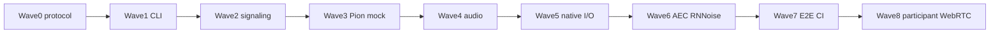

# Backend implementation plan

Orchestration guide for `spidercamd` (Go CLI). **Do not implement in this doc** — delegate waves to subagents: Implement → Review → Test → Gate.

## Status (2026-06-14)

| Layer                                  | State               | Evidence                                      |
| -------------------------------------- | ------------------- | --------------------------------------------- |
| Frontend + protocol                    | Done                | `web/host`, `web/participant`, `web/protocol` |
| Mock API server                        | Done                | `apps/mock-server` — behavioral reference     |
| Wave 5 native I/O spikes               | **Done (9/9 pass)** | [experiments/wave5/](../experiments/wave5/)   |
| Go module + preview framing            | Partial             | `go.mod`, `internal/preview/pack.go` (P5.8)   |
| `cmd/spidercamd` + rest of `internal/` | Pending             | This plan                                     |

Decisions D21–D30: [DECISIONS.resolved.md](./DECISIONS.resolved.md). WebRTC: browser offers, hub answers (D21).

## Experiment → production promotion

| Experiment                                               | Promote to                                          | Notes                               |
| -------------------------------------------------------- | --------------------------------------------------- | ----------------------------------- |
| [p5.1-pw-list](../experiments/wave5/p5.1-pw-list/)       | `internal/capture/native/sp_devices.c`              | JSON enum pattern for `ListDevices` |
| [p5.2-pw-capture](../experiments/wave5/p5.2-pw-capture/) | `internal/capture/native/sp_capture.c`, `sp_ring.c` | **Copy** pthread + SPSC rings       |
| [p5.4-v4l2-cam](../experiments/wave5/p5.4-v4l2-cam/)     | `internal/capture/v4l2_camera.go`                   | `github.com/blackjack/webcam`       |
| [p5.5-loopback](../experiments/wave5/p5.5-loopback/)     | `internal/output/v4l2.go`                           | ioctl + sysfs discovery             |
| [p5.6-pulse](../experiments/wave5/p5.6-pulse/)           | `internal/output/pulse.go`                          | `github.com/jfreymuth/pulse`        |
| [p5.7-x264](../experiments/wave5/p5.7-x264/)             | `internal/preview/native/enc_x264.c`                | libx264 baseline IDR                |
| [p5.8](../internal/preview/pack.go)                      | Already in tree                                     | `PackChunk`, `AnnexBToAVCC`         |
| [p5.9-reopen](../experiments/wave5/p5.9-reopen/)         | `Bundle.Reopen` tests                               | < 500 ms sink switch                |

---

## Wave dependency graph



Wave 5 implementation is **de-risked** — promote experiment code; do not re-spike.

---

## Wave 0 — Foundation

**Goal:** `internal/protocol`, `internal/room`, fixture tests, Makefile.

```go
// go.mod — EXISTS
module github.com/markus/spidercam
go 1.22
```

```go
// internal/protocol/types.go — mirror web/protocol/src/types.ts + plan/domain/types.md
type RoomState struct {
    Participants      []ParticipantInfo `json:"participants"`
    Metrics           []StreamMetrics `json:"metrics"`
    Reference         ReferenceMetrics `json:"reference"`
    Selection         *SelectionState `json:"selection"`
    Capture           CaptureState `json:"capture"`
    OutputHealthy     bool `json:"outputHealthy"`
    GlobalLatencyMs   *int `json:"globalLatencyMs"`
    OutLevelDbfs      float64 `json:"outLevelDbfs"`
    OutPeakDbfs       float64 `json:"outPeakDbfs"`
    EnhancementBudgetPct float64 `json:"enhancementBudgetPct"`
    ParticipantURL    string `json:"participantUrl"`
}
```

```go
// internal/room/room.go
type Room struct {
    mu       sync.RWMutex
    config   protocol.HostConfig
    connected map[string]ConnectedParticipant
    capture  protocol.CaptureState
}

func (r *Room) FullState(engine EngineView, cap capture.Bundle, out output.Writer) protocol.RoomState
func (r *Room) ViewFor(clientID string, selfMetric SelfMetricSource) protocol.ParticipantRoomView
```

**Gate:** `go test ./internal/protocol/... ./internal/room/... -count=1`

---

## Wave 1 — CLI + dual HTTP

See [architecture/daemon.md](./architecture/daemon.md). Pseudo unchanged; embed `web/host/dist`, `web/participant/dist`.

**Gate:** `curl /api/health` on :1234 and :1235; SPA HTML on `/`.

---

## Wave 2 — Signaling + REST

Port [apps/mock-server/src/host-handlers.ts](../apps/mock-server/src/host-handlers.ts) and [scenario-engine.ts](../apps/mock-server/src/scenario-engine.ts) to Go.

```go
// internal/signaling/host.go — 50 Hz broadcast
func (h *HostHub) BroadcastLoop(ctx context.Context) {
    t := time.NewTicker(20 * time.Millisecond)
    for {
        select {
        case <-ctx.Done():
            return
        case <-t.C:
            h.BroadcastJSON(protocol.HostStateMsg{State: h.room.FullState(...)})
        }
    }
}
```

**Gate:** Host UI against daemon shows live `host-state` (mock engine OK).

---

## Wave 3 — Pion + mock capture/output

```go
// internal/webrtc/hub.go — D21: browser offers, hub answers
func (h *Hub) HandleOffer(clientID, sdp string) (answer string, err error) {
    peer, err := h.getOrCreate(clientID)
    if err != nil { return "", err }
    return peer.SetRemoteOfferAndCreateAnswer(sdp)
}
```

Mock capture/output until Wave 5 wires native packages.

**Gate:** Go E2E `webrtc_test.go` — offer/answer exchange.

---

## Wave 4 — Audio core

See [audio/overview.md](./audio/overview.md). 10 ms `engine.Run`, selector @ 20 ms, feeds mock `output.Writer`.

**Gate:** `go test ./internal/audio/... ./internal/selector/... -race`

---

## Wave 5 — Native I/O (promote experiments)

Split into **5a capture**, **5b output**, **5c preview encoder**. Reference: [architecture/capture.md](./architecture/capture.md), [output.md](./architecture/output.md), [preview.md](./architecture/preview.md).

### 5a — PipeWire capture (`internal/capture/`)

Promote from [experiments/wave5/p5.2-pw-capture/](../experiments/wave5/p5.2-pw-capture/):

```c
// internal/capture/native/sp_capture.c — validated API
sp_capture *sp_capture_open(const char *mic_id, const char *sink_id, int sample_rate);
void sp_capture_close(sp_capture *c);
int sp_capture_read_mic(sp_capture *c, float *buf, int frames);    // 480 samples
int sp_capture_read_monitor(sp_capture *c, float *buf, int frames);
```

**Required patterns (D25, P5.2/P5.9):**

- Dedicated `pthread` + `pw_main_loop_run`
- **Iterate** `pw_loop_iterate` during `pw_core_sync` (never block before loop runs)
- Teardown: `spa_hook_remove` on registry/core listeners (not single-arg `pw_registry_destroy`)
- `Reopen`: close + reopen < 500 ms (P5.9: 11.82 ms measured)

```go
// internal/capture/native.go
//go:build cgo && linux

func openNative(sel Selection) (*Bundle, error) {
    cap := C.sp_capture_open(micC, sinkC, 48000)
    cam, err := openV4L2(sel.CameraID) // blackjack/webcam — P5.4
    return &Bundle{...}, nil
}

// internal/capture/capture_stub.go
//go:build !cgo || !linux
```

```go
// internal/capture/v4l2_camera.go — from P5.4
import "github.com/blackjack/webcam"

func listV4L2Cameras() ([]DeviceInfo, error) {
    for _, path := range glob("/dev/video*") {
        if card := sysfsCardName(path); isCaptureNode(path) {
            out = append(out, DeviceInfo{ID: path, Label: card})
        }
    }
}
```

### 5b — Virtual output (`internal/output/`)

Promote from [p5.5-loopback](../experiments/wave5/p5.5-loopback/) + [p5.6-pulse](../experiments/wave5/p5.6-pulse/):

```go
// internal/output/discover.go — D30
func FindLoopbackDevice() (string, error) {
    // sysfs /sys/class/video4linux/video*/name contains "loopback"
    // SPIDERCAM_VIDEO_DEVICE overrides
}

// internal/output/v4l2.go — D24
const v4l2CapVideoOutput = 0x00000002 // NOT 0x20000

func openV4L2Output(path string) (*v4l2Writer, error) {
    // VIDIOC_QUERYCAP with _IOR ioctl direction
    // VIDIOC_ENUM_FMT → prefer YUYV, RGB24
    // VIDIOC_G_FMT then VIDIOC_S_FMT; on EINVAL fall back to G_FMT defaults (P5.5)
}
```

```go
// internal/output/pulse.go — D22
import "github.com/jfreymuth/pulse"

func openPulseSink(name string) (*pulseSink, error) {
    client, err := pulse.NewClient()
    stream, err := client.NewPlayback(pulse.Float32Reader(...), pulse.PlaybackSampleRate(48000))
}
```

```go
// internal/output/output.go — D28 check-only
func Open(ctx context.Context, cfg Config) (Writer, error) {
    if cfg.Mock { return &mockWriter{}, nil }
    vidPath := cfg.VideoDevice
    if vidPath == "" {
        vidPath, _ = FindLoopbackDevice()
    }
    if vidPath == "" {
        return nil, fmt.Errorf("no v4l2loopback device: modprobe v4l2loopback ...")
    }
    // ...
}
```

**Operator setup** (document in daemon banner / README):

```bash
sudo modprobe v4l2loopback video_nr=2 card_label="spidercam-loopback" exclusive_caps=1
pactl load-module module-null-sink sink_name=spidercam_sink \
  sink_properties=device.description=Spidercam_Virtual_Mic
```

Note: `video_nr=2` may not be `/dev/video2` if that node exists — use sysfs discovery (D30).

### 5c — Preview encoder

`internal/preview/pack.go` **already implemented** (P5.8). Add:

```go
// internal/preview/stream.go
func (s *Stream) OnFrame(v VideoFrame, sel *protocol.SelectionState) (cut bool) {
    // subsample 30→15 fps; enc.Encode → PackChunk(avcc, pts, key)
}

// internal/preview/enc_mock.go — CI / --mock
// internal/preview/native/enc_x264.c — promote from experiments/wave5/p5.7-x264/enc_test.c
```

**Gate:** native `spidercamd` (no `--mock`) opens devices; host preview canvas decodes; `outputHealthy` reflects device state.

---

## Wave 6 — AEC + RNNoise

Passthrough mock in CI; cgo on dev host. See [audio/echo-cancellation.md](./audio/echo-cancellation.md).

---

## Wave 7 — E2E + CI

```yaml
# .github/workflows/ci.yml
- go test ./internal/... -race -count=1
- go test ./test/e2e/... -tags=e2e # spidercamd --mock
- npm run lint && npm run check && npm run test:ui
```

`internal/preview` framing tests already run without cgo.

---

## Wave 8 — Participant WebRTC (frontend)

Replace [web/participant/src/adapters/fake-peer.ts](../web/participant/src/adapters/fake-peer.ts):

```ts
// D21: browser offers
const offer = await pc.createOffer();
await signaling.send({ type: "offer", sdp: offer.sdp });
// apply answer from hub
```

---

## Subagent prompt template (Wave 5a example)

```
Full Repository Path: /home/markus/projects_private/spidercam

Wave 5a: Promote PipeWire capture from experiments/wave5/p5.2-pw-capture/ to internal/capture/native/.

Read: plan/BACKEND.md Wave 5a, plan/architecture/capture.md, plan/DECISIONS.resolved.md D25.

Copy sp_capture.c, sp_ring.c, sp_capture.h into internal/capture/native/.
Add cgo wrapper native.go and capture.go facade (Open, Reopen, Close, ListDevices).
Add capture_stub.go for !cgo || !linux.

Do NOT re-spike — preserve pthread loop iterate during pw_core_sync and spa_hook_remove teardown.

Gate: go test ./internal/capture/... ; manual: capture reads mic frames on dev host.
```

---

## Quality gate

```bash
go vet ./...
go test ./internal/... -race -count=1
go test ./test/e2e/... -tags=e2e -count=1
npm run lint && npm run format:check && npm run check
npm run test:ui
```
