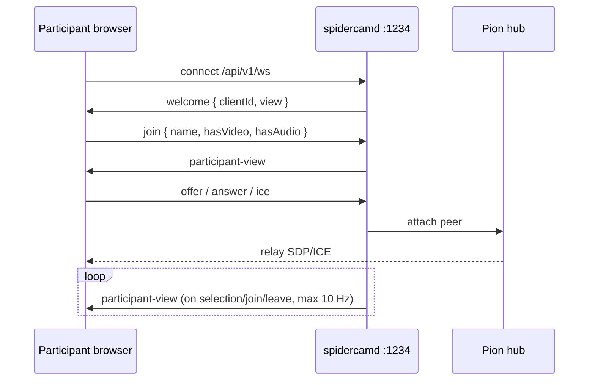

# Signaling

**Target:** `internal/signaling/participant.go`, `internal/signaling/host.go`, `internal/signaling/preview_hub.go`

Two **separate HTTP listeners** on two ports — no shared broadcast fan-out. Each listener: static SPA at `/`, API at `/api/v1/`.

**Full route reference:** [API.md](../API.md).

## Participant API — `:1234/api/v1`

WebSocket: `ws://<host>:1234/api/v1/ws`. JSON messages validated against [domain/messages.md](../domain/messages.md).



### Handler sketch

```go
func (s *ParticipantWS) HandleJoin(clientID string, msg protocol.Join) {
	s.room.AddParticipant(clientID, msg)
	s.sendTo(clientID, protocol.ParticipantViewMsg(s.room.ViewFor(clientID)))
	s.broadcastParticipantViews() // slim payload only
}

func (s *ParticipantWS) HandleWebRTC(clientID string, msg protocol.SignalingMessage) {
	s.hub.Relay(clientID, msg)
}

// Never sends full RoomState or other participants' StreamMetrics
```

## Host API — `:1235/api/v1`

Loopback only. REST for snapshots/commands; **two** WebSockets for live host UI.

```go
// REST — see API.md
// GET  /api/health
// GET  /api/v1/host/state
// POST /api/v1/host/config
// GET  /api/v1/capture/devices
// POST /api/v1/capture/selection

// Control WebSocket: GET /api/v1/ws
func (s *HostWS) HandleConfig(msg protocol.ConfigMsg) {
	s.room.UpdateConfig(msg.Config)
	s.engine.ApplyConfig(msg.Config)
}

func (s *HostWS) HandleListCaptureDevices() {
	devs, _ := capture.ListDevices()
	s.send(protocol.CaptureDevicesMsg{Devices: devs})
}

func (s *HostWS) HandleSetCaptureDevices(msg protocol.SetCaptureDevicesMsg) {
	if err := s.capture.Reopen(ctx, msg.Selection); err != nil {
		s.send(protocol.CaptureDevicesUpdatedMsg{Error: err.Error()})
		return
	}
	s.engine.ResetLoopDelaySamples()
	s.engine.ResetAllAEC()
	s.send(protocol.CaptureDevicesUpdatedMsg{State: s.capture.ActiveState()})
}

func (s *HostWS) HandleSetStreamProcessing(msg protocol.SetStreamProcessingMsg) {
	if err := s.engine.SetStreamProcessing(msg.ParticipantID, msg.Flags); err != nil {
		return // log; optional error frame later
	}
}

func (s *HostWS) broadcastLoop() {
	// every 20ms
	s.broadcast(protocol.HostStateMsg{
		State: s.room.FullState(s.engine),
	})
}

// Preview WebSocket: GET /api/v1/ws/preview — see architecture/preview.md
func (s *PreviewHub) HandleUpgrade(w http.ResponseWriter, r *http.Request) {
	c := s.upgrade(w, r)
	c.SendJSON(protocol.PreviewStreamInitMsg{ /* ... */ })
	for chunk := range c.Subscribe(s.preview.Chunks()) {
		c.SendBinary(chunk)
	}
}
```

### Host control socket (`/api/v1/ws`)

| Type | Direction | Rate |
|------|-----------|------|
| `host-state` | server → UI | 50 Hz |
| `config` | UI → server | on save |
| `list-capture-devices` | UI → server | settings open |
| `capture-devices` | server → UI | device list response |
| `set-capture-devices` | UI → server | device save |
| `set-stream-processing` | UI → server | per-card AEC/NS toggle |
| `capture-devices-updated` | server → UI | after reopen |
| `copy-participant-url` | UI → server | on click → `participant-url` |

### Host preview socket (`/api/v1/ws/preview`)

| Type | Direction | Rate |
|------|-----------|------|
| `preview-stream-init` | server → UI | once per connect |
| `preview-cut` | server → UI | on `activeVideoId` change |
| H.264 binary chunks | server → UI | 15 fps |

Details: [architecture/preview.md](./preview.md).

## Participant message types

| Type | Direction | Rate |
|------|-----------|------|
| `welcome` | server → client | once |
| `join` / `leave` | client → server | on action |
| `participant-view` | server → client | on change, max 10 Hz |
| `offer` / `answer` / `ice-candidate` | both | on demand |

## TypeScript clients

```ts
// web/participant/src/signaling.ts
export class ParticipantSignaling {
  connect(url = `ws://${location.host}/api/v1/ws`): Promise<void>;
  onView(handler: (view: ParticipantRoomView) => void): void;
}

// web/host/src/signaling.ts
export class HostSignaling {
  connect(url = `ws://${location.host}/api/v1/ws`): Promise<void>;
  onState(handler: (state: RoomState) => void): void;
  sendConfig(partial: Partial<HostConfig>): void;
  listCaptureDevices(): void;
  setCaptureDevices(sel: CaptureSelection): void;
  setStreamProcessing(participantId: string, flags: StreamProcessingFlags): void;
}

// web/host/src/preview-stream.ts
export class PreviewStream {
  connect(url = `ws://${location.host}/api/v1/ws/preview`): void;
}
```

No shared `SignalingClient` with dual mode — three thin clients (participant WS, host control WS, host preview WS), two ports.
