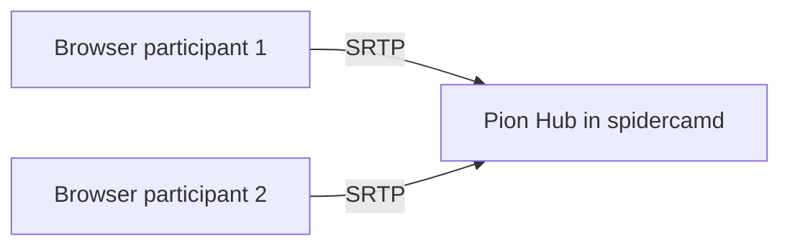

# WebRTC (Pion)

**Target:** `internal/webrtc/`

Star topology: **Go hub** holds one `PeerConnection` per participant. Browsers send mic/cam; Go receives RTP, decodes to PCM/RGBA for the audio engine.

## Topology



Host UI **does not** use WebRTC. Host mic/cam come from [capture.md](./capture.md).

## Hub interface

```go
package webrtc

type Hub struct {
	peers map[string]*Peer
	onAudio func(participantID string, pcm []float32)
	onVideo func(participantID string, frame VideoFrame)
}

func NewHub(room *room.Room) *Hub

func (h *Hub) HandleOffer(clientID string, sdp string) (answer string, err error)
func (h *Hub) HandleICE(clientID string, candidate string) error
func (h *Hub) RemovePeer(clientID string)
func (h *Hub) Stats(clientID string) TransportStats
```

## Peer setup

```go
// internal/webrtc/peer.go
import "github.com/pion/webrtc/v4"

func (h *Hub) createPeer(clientID string) (*Peer, error) {
	pc, err := webrtc.NewPeerConnection(webrtc.Configuration{
		ICEServers: []webrtc.ICEServer{{URLs: []string{"stun:stun.l.google.com:19302"}}},
	})
	// OnTrack: audio → Opus decode → jitter buffer → onAudio callback
	// OnTrack: video → depacketize → onVideo callback
}
```

## Opus → PCM

- Use Pion `TrackRemote` + `oggreader` / built-in sample builder
- Target: float32 mono 48 kHz, 480-sample frames into `internal/audio/jitter`

## Browser side (participant only)

```ts
// web/participant/src/webrtc.ts
export class ParticipantPeer {
  constructor(private signaling: ParticipantSignaling) {}

  async start(localStream: MediaStream): Promise<void> {
    this.pc = new RTCPeerConnection({
      iceServers: [{ urls: "stun:stun.l.google.com:19302" }],
    });
    // add tracks, create offer, exchange via :1234/api/v1/ws
  }
}
```

## Transport stats

Poll Pion `GetStats` @ 1 Hz → merge into `StreamMetrics` for host-state (RTT, loss, jitter, fps).

## ICE

STUN only (same LAN room).
